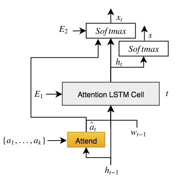

# Senti-Attend Model

TensorFlow implementation of [Image Captioning using Sentiment and Attention](https://arxiv.org/abs/1811.09789).

<p align="center">

</p>

### Reference
if you use our codes or models, please cite our paper:
```
@article{nezami2018senti,
  title={Senti-Attend: Image Captioning using Sentiment and Attention},
  author={Mohamad Nezami, Omid and Dras, Mark and Wan, Stephen and Paris, Cecile},
  journal={arXiv preprint arXiv:1811.09789},
  year={2018}
}
```
### Data
We train our models using both [Microsoft COCO Dataset](http://cocodataset.org/#download) and [SentiCap Dataset](http://cm.cecs.anu.edu.au/post/senticap/).

## Requiremens
1. Python 2.7.12
2. Numpy 1.15.2
3. Hickle
4. Tensorflow 1.8.0

### Content
1. [Resize Code](./resize.py)
1. [Senti-Attend Train](./train.py)
2. [Senti-Attend Test](./test.py)
3. [Senti-Attend Model](./lib/SentiAttend.py)

### Train
1. Download [Microsoft COCO Dataset](http://cocodataset.org/#download) including neutral image caption data and [SentiCap Dataset](http://cm.cecs.anu.edu.au/post/senticap/) including sentiment-bearing image caption data.
2. Label the COCO captions as natural ones using one-hot encoding (e.g., [0,1,0]).
3. Label the positive captions (e.g., [1,0,0]) and the negative captions (e.g., [0,0,1]) of the SentiCap dataset.
4. Resize the downloded images into [224, 224] using (the resize code)[./resize.py] and put them in "./images".
5. Preprosses the combination of the COCO image caption data and the SentiCap image caption data with their sentiment one-hot encodings. You can do this by [prepro.py](https://github.com/yunjey/show-attend-and-tell) and the ResNet-152 network trained on ImageNet, which is generating [7,7,2048] feature map (we use the Res5c layer of the network).
6. Put the preprocessed data into "./data".
7. python train.py

### Test
1. Download [the pretrained model]() and unzip the model in "./model".
2. Separate the positive part and the negative part for evaluation.
3. Put the positive and the negative parts into './data_evaluation/positive' and './data_evaluation/negative', respectively. 
2. python test.py (switch=1 for the positive part and switch=-1 for the negative part).

### Results
|                   | BLEU-1 | BLEU-4 | METEOR | ROUGE-L | CIDEr | SPICE
|-------------------|:-------------------:|:------------------------:|:---------------------:|:---------------------:|:---------------------:|:---------------------:|
|ATTEND-GAN| 58.10%  | 13.70% | 18.95%  | 45.40%  | 70.25% | 17.05%  |

ATTEND-GAN is inspired from [Show-Attend-Tell model](https://github.com/yunjey/show-attend-and-tell) and [Self-critical-Sequence-Training model](https://github.com/weili-ict/SelfCriticalSequenceTraining-tensorflow) in TensorFlow.