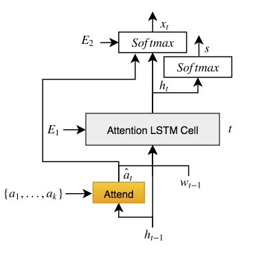

# Senti-Attend Model

TensorFlow implementation of [Image Captioning using Sentiment and Attention](https://arxiv.org/abs/1811.09789).

<p align="center">

</p>

### Reference
if you use our codes or models, please cite our paper:
```
@article{nezami2018senti,
  title={Senti-Attend: Image Captioning using Sentiment and Attention},
  author={Mohamad Nezami, Omid and Dras, Mark and Wan, Stephen and Paris, Cecile},
  journal={arXiv preprint arXiv:1811.09789},
  year={2018}
}
```
### Data
We train our models using both [Microsoft COCO Dataset](http://cocodataset.org/#download) and [SentiCap Dataset](http://cm.cecs.anu.edu.au/post/senticap/).

## Requiremens
1. Python 2.7.12
2. Numpy 1.15.2
3. Hickle
4. Python-skimage
3. Tensorflow 1.8.0

### Contents
1. [Train code](./train.py)
2. [Test code](./test.py)

Senti-Attend is inspired from [Show-Attend-Tell model](https://github.com/yunjey/show-attend-and-tell) in TensorFlow.
